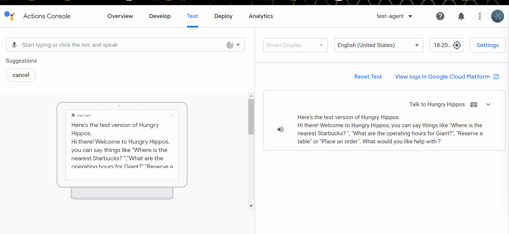
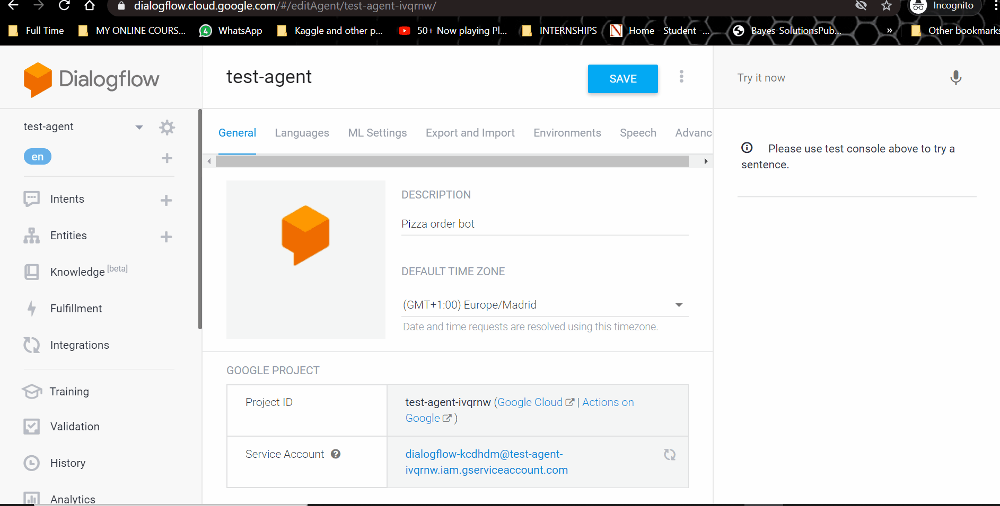
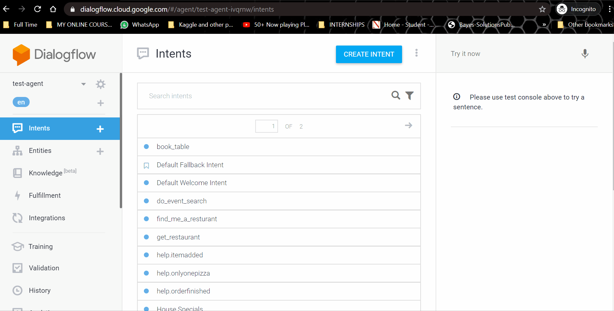

### DS5500 Project 2 : Intent Detection Bot using Dialogflow
##### ***Professor In-Charge: Andrew Therriault***
##### ***Project Partners : Ankit Phaterpekar, Nanditha Sundararajan***

#### INTRODUCTION ####
Conversational bots have many applications throughout the industry today as businesses are looking to take advantage of deploying such services on messaging platforms, voice assistant devices like Google Home, Alexa or customer service bots with the goal of improving user interaction, reducing time or freeing up time taken to service simple tasks.
Our goal was to explore building a task oriented chatbot into an initial minimum viable product that can aid in providing information about business (restaurants, grocery stores, retail stores, pharmacies, etc) from the Yelp directory, such as finding business location, operating hours or notify the user about any nearby events as well as  automate some of the tasks that go into a reservation system or placing an order. We believe collecting feedback on this initial version and future development cycles would lead to a fully fleshed out agent that could be used by Yelp or Opentable for providing alternate ways to engage with the customer in lieu of the traditional website search.
 
  

 
  
#### CONFIGURE DIALOGFLOW ####
1. Go to www.dialogflow.com and enter your Gmail credentials
2. Create an agent in Dialogflow,import the Intent_Detection_Bot/test-agent.zip and enable the beta features as shown below.

 
  

3.The intents, entities will be added automatically after the importation

 
 

4. Go to fulfillments section and enable Inline Editor. Copy and paste the cloud functions codes present in Intent_Detection_Bot/function_source/index.js under index.js and Intent_Detection_Bot/function_source/package.json under package.json and deploy it.

 
 

#### INTENTS,ENTITIES AND CONFIDENCE INTERVAL ####
1. Consider the intent **search_business** that fetches details about a business given the name and user's location. We can add our own training phrases, map it with custom      entities and save it.
2. While testing in the Dialogflow console, if the exact training phrase is entered, the intent matching confidence is high whereas, if the user query contains a mistake as shown below, the intent matching confidence is really low which indicates that the intents are poorly matched. The default confidence threshold is 0.3. 
 
  

### INTEGRATION OF AGENT WITH GOOGLE ASSISTANT  
a)   
      
    
    Our Agent can be integrated with Google Assistant via the one-click integration which will take us to the Actions console. Here, in the Overview, we can see the steps         that needs to followed so that we can test and deploy our agent.
    
b)   
      
    As shown here, there are various steps available in Deploy tab: 
     a) Directory Information -  
     b) Location targeting -  
     c) Surface capabilities - 
     d) Release - There are two types of releases available. We have opted to go for a Alpha release as shown in the above gif. Additional Alpha Testers can be added so that      they can access our agent via their personal Google Assistant via smartphones/Google Home etc.
#### NOTE: Testers should provide us with their personal email id so that we can add them as Alpha testers and grant access for testing our Intent Detection Bot. Please mail your personal email id to phaterpekar.ankit@gmail.com or os.nandhu@gmail.com

